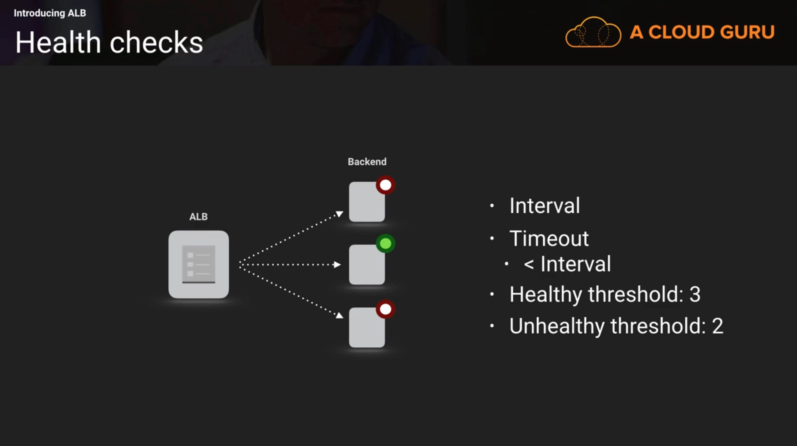
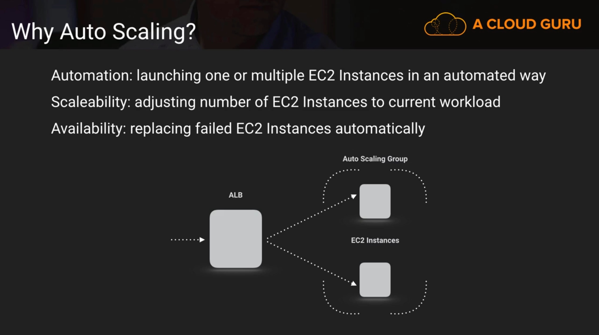

# Cisco cloud corner on AWS Elastic Load Balancer (ELB) and Auto Scaling
Prerequisites:
- You must have a valid AWS account

This workshop has been inspired by the aCloudGuru course [Deep Dive into Application Load Balancer (ALB)](https://acloud.guru/course/aws-application-loadbalancer/dashboard)

## Creating an Application Load Balancer (ALB). Time: 5 min

An Application Load Balancer makes routing decisions at the application layer (HTTP/HTTPS), supports path-based routing, and can route requests to one or more ports on each EC2 instance or container instance in your VPC.



1. From the AWS console, go to **Compute** -> **EC2**
1. Select **Load Balancers** in the **LOAD BALANCING** section
1. Select **Create Load Balancer**
1. Select **Application Load Balancer** and click **Continue**
  1. Step 1 - Configure Load Balancer. Select:
      1. __Basic Configuration__
          - Name: **cloudCornerALB**
          - Scheme: **internet-facing**
          - IP address type: **ipv4** (I know, it's bad)
      1. __Listeners__
          - HTTP: **80**
      1. __Availability Zones__
          - VPC: Default VPC
          - Add all the availability Zones
      1. Click **Next:Configure Security Settings**
  1. Step 2 - Configure Security Settings
      1. Click **Next:Configure Security Groups**
  1. Step 3 - Configure Security Groups
      1. Create a new security group
        - Security group name: **aCloudCorner-alb**
        - Description: **acloudCorner-alb**
      1. Keep the default rule:
        - Type : **Custom TCP Rule**
        - Protocol: **TCP**
        - Port Range: **80**
        - Source: **0.0.0.0/0**
      1. Click **Next:Configure Routing**
  1. Step 4 - Configure Routing
      1. __Target Group__
        - Target group: **New target group**
        - Name: **webServer-tg**
        - Protocol: **HTTP**
        - Port: **80**
      1. __Health checks__
        - Protocol: **HTTP**
        - Path: **/**
      1. __Advanced health check settings__
        - Port: **traffic port**
        - Healthy threshold: **2**
        - Unhealthy threshold: **2**
        - Timeout: **5**
        - Interval: **6**
        - Success codes: **200-299**
      1. Click **Next:Register Targets**
    1. Step 5 - Register Targets
      1. Click **Next:Review**
    1. Step 6 - Review
      1. Click **Create**
1. Summary
    - ALB is running
    - ALB listens on port 80 thanks to target group **webServer-tg**
    - Security Group **aCloudCorner-alb** allows incoming traffic to ALB on port 80

## Creating EC2 with Application Load Balancer (ALB). Time: 10 min
### Create an EC2 instance
1. From the AWS console, go to **Compute** -> **EC2**
1. Select **Instances** in the **INSTANCES** section
1. Select **Launch instance**, choose the first AMI in the list (Amazon Linux AMI) and click **Select**
1. Keep the default Instance type (Free tier eligible) and click **Next:Configure Instance Details**
1. Select:
  - Number of instances: **1**
  - Network: **default network**
  - Subnet: **No preference**
1. Open the **Advanced Details** section and copy paste

  ```bash
  #!/bin/bash
  yum update -y
  yum install httpd -y
  service httpd start
  chkconfig httpd on
  echo "Hello Cloud Corners. My Web Server address is: " > /var/www/html/index.html
  curl http://169.254.169.254/latest/meta-data/local-ipv4 >>  /var/www/html/index.html
  ```
1. Click **Next:Add Storage**
1. Click **Next:Add Tags** and Enter:
  - Key: **Name**
  - Value: **myWebServer**
1. Click **Next:Configure Security Group**
1. Create a new Security Group and Enter:
  - Security Group Name: **aCloudCorner-web**
  - Description: **aCloudCorner-web**
1. Click **Add Rule** and Enter:
  - Type: **HTTP**
  - Source: **sg-xxxxxxxx - aCloudCorner-alb**
1. Click **Review and Launch**
1. Click **Launch**
1. In the "Select an existing key pair or create a new key pair window"
  - Select an existing key pair or create a new one
  - Acknowledge and click **Launch Instance**
1. Click **View instances**. The first EC2 instance is now under creation. When it will be ready, it will have a Public IP assigned
1. Copy/Paste the public IP Address in your browser. Nothing happens because the EC2 instance is not internet accessible. We need to register the EC2 instance with the target group of the load balancer.

### Register the EC2 instance with the target group of the load balancer
1. From the AWS console, go to **Compute** -> **EC2**
1. Select **Target Groups** in the **LOAD BALANCING** section
1. Select **webServer-tg** target group, go to folder **Targets** and click **Edit**
1. Select EC2 instance **myWebServer** and click **Add to registered** on port 80
1. Click **Save**
1. Select **Load Balancers** in the **LOAD BALANCING** section
1. Select **cloudCornerALB** Load Balancer and copy **DNS name**
1. Paste the ALB DNS name in your browser. You should see the message **"Hello Cloud Corners. My Web Server address is: xx.xx.xx.xx"**

### Cleanup
1. From the AWS console, go to **Compute** -> **EC2**
1. Select **Instances** in the **INSTANCES** section
1. Select **myWebServer** instance in the list and click **Actions -> Instance State -> Terminate**

## Autoscaling: Automation, Scalability & Availability. Time: 40 min
### Create a Launch Configuration
A launch configuration is a template that an Auto Scaling group uses to launch EC2 instances.


1. From the AWS console, go to **Compute** -> **EC2**
1. Select **Auto Scaling Groups** in the **AUTO SCALING** section
1. Select **Create Auto Scaling Group**
1. Select **Create launch configuration**, choose the first AMI in the list (Amazon Linux AMI) and click **Select**
1. Keep the default Instance type (Free tier eligible) and click **Next:Configure details**
1. Select:
  - Name: **aCloudCorner-lc**
1. Open the **Advanced Details** section and Enter
  - User Data:

  ```bash
  #!/bin/bash
  yum update -y
  yum install httpd -y
  service httpd start
  chkconfig httpd on
  echo "Hello Cloud Corners. My Web Server address is: " > /var/www/html/index.html
  curl http://169.254.169.254/latest/meta-data/local-ipv4 >>  /var/www/html/index.html
  ```
  - IP Address Type: **Assign a public IP address to every instance**
1. Click **Next:Add Storage**
1. Click **Next:Configure Security Group**
1. Select existing Security Group:
  - Name: **aCloudCorner-web**
1. Click **Review**
1. Click **Create launch configuration**
1. In the "Select an existing key pair or create a new key pair window"
  - Select an existing key pair or create a new one
  - Acknowledge and click **Create launch configuration**

### Create an Auto Scaling Group
An Auto Scaling group contains a collection of EC2 instances that share similar characteristics and are treated as a logical grouping for the purposes of instance scaling and management

1. Enter
    - Group Name: **aCloudCorner-asg**
    - Group size:  **Start with 2 instances**
    - Network: Select the default VPC
    - Subnet: Select all subnets in the list
1. Open the **Advanced Details** section and Enter:
    - Load Balancing: **Receive traffic from one or more load balancers**
    - Classic Load Balancers: Let it blank
    - Target groups: **webServer-tg**
    - Health Check Type: **ELB**
1. Select **Next: Configure scaling policies**.
1. Select **Use scaling policies to adjust the capacity of this group** and Enter
    - Scale between **2** and **3** instances. These will be the minimum and maximum size of your group.
    - Increase Group Size
        - Name: **Increase Group Size**
        - Execute policy when.
        - Select **Add new alarm**
            - Unselect **Send a notification to**
            - Whenever: **Average** of **CPU Utilization** Is **>=** **5** Percent
            - For at least **1** consecutive period(s) of **1 Minute**
            - Name of alarm: **aCloudCorner-CPUAlarm-UP**
            - Select **Create Alarm**
        - Take the action: **Add 1 Instances ** when **5** <= CPUUtilization < +infinity
        Instances need: **60** seconds to warm up after each step
    - Decrease Group Size
        - Name: **Decrease Group Size**
        - Execute policy when.
        - Select **Add new alarm**
            - Unselect **Send a notification to**
            - Whenever: **Average** of **CPU Utilization** Is **<=** **1** Percent
            - For at least **1** consecutive period(s) of **1 Minute**
            - Name of alarm: **aCloudCorner-CPUAlarm-DOWN**
            - Select **Create Alarm**
        - Take the action: **Remove 1 Instances ** when **1** >= CPUUtilization > -infinity
1. Select **Next: Configure Notifications**
1. Select **Next: Configure tags** and Enter:
  - Key: **Name**
  - Value: **myWebServer-asg**
1. Select **Review**
1. Select **Create Auto Scaling group**

  The Auto scaling group has now started 2 EC2 instances for you
1. Select **Target Groups** in the **LOAD BALANCING** section
1. Select **webServer-tg** target group, go to folder **Targets**
1. Refresh your AWS console until the 2 EC2 instances are **healthy**
1. Got to **LOAD BALANCER** and click **Load Balancers**
1. Select **cloudCornerALB** Load Balancer and copy **DNS name**
1. Paste the ALB DNS name in your browser. You should see the message **"Hello Cloud Corners. My Web Server address is: xx.xx.xx.xx"**
1. Refresh the browser multiple times. You should see 2 different IP addresses

### Check High Availability
Auto scaling is able to replace a failed EC2 instance

1. From the AWS console, go to **Compute** -> **EC2**
1. Select **Instances** in the **INSTANCES** section
1. Select one of the running Instances
1. Copy the Public IP
1. Open a terminal
1. Make sure your SSH key is available and is protected against write (chmod 0600)
1. Enter

  ```bash
  ssh ec2-user@<publicIP> -i <keyPair.pem>
  ```
  ```bash
  sudo su
  # Stop the HTTP server
  service httpd stop
  ```
1. Select **Load Balancers** in the **LOAD BALANCING** section
1. Select **cloudCornerALB** Load Balancer and copy **DNS name**
1. Paste the ALB DNS name in your browser. You should see the message **"Hello Cloud Corners. My Web Server address is: xx.xx.xx.xx"**
1. Refresh the browser multiple times. You should see now 1 IP address instead of 2
1. From the AWS console, go to **Compute** -> **EC2**
1. Select **Target Groups** in the **LOAD BALANCER** section
1. Select the target group **webServer-tg** in the list
1. Select the **Targets** tab

  One of the EC2 instance should be "unhealthy"

1. Refresh the AWS console until a new EC2 instance has been created
1. Go back to the DNS browser window
1. Refresh the browser multiple times. You should see now 2 different IP addresses

### Automatic Scaling UP based on CloudWatch alarm
We will create a separate EC2 instance to simulate CPU overload on the EC2 instances of the target group

1. From the AWS console, go to **Compute** -> **EC2**
1. Select **Instances** in the **INSTANCES** section
1. Select **Launch instance**, choose the first AMI in the list (Amazon Linux AMI) and click **Select**
1. Keep the default Instance type (Free tier eligible) and click **Next:Configure Instance Details**
1. Select:
  - Network: **default network**
  - Subnet: **No preference**
1. Open the **Advanced Details** section and copy paste

  ```bash
  #!/bin/bash
  yum update -y
  yum install httpd -y
  ```
1. Click **Next:Add Storage**
1. Click **Next:Add Tags** and Enter:
  - Key: **Name**
  - Value: **LoadTest**
1. Click **Next:Configure Security Group**
1. Select existing Security Group:
  - Name: **aCloudCorner-web**
1. Click **Review and Launch**
1. Click **Launch**
1. In the "Select an existing key pair or create a new key pair window"
  - Select an existing key pair or create a new one
  - Acknowledge and click **Launch Instance**
1. Click **View instances**. The **LoadTest** EC2 instance is now under creation. When it will be ready, it will have a Public IP assigned. Copy the Public IP address
1. Open a terminal
1. Make sure your SSH key is available and is protected against write (chmod 0600)
1. Enter

  ```bash
  ssh ec2-user@<publicIP> -i <keyPair.pem>
  ```
  ```bash
  sudo su
  # We’re using the following command for the load test, to send 500,000 requests to the load balancer using two threads. <UrlLoadBalancer> is replaced by the URL of the load balancer:
  ab -n 500000 -c 2 <UrlLoadBalancer>
  ```
1. From the AWS console, go to **Management Tools** -> **CloudWatch**
1. Select **Alarms**
1. Wait 1 or 2 minutes until the alarm **aCloudCorner-CPUAlarm-UP** is triggered
1. From the AWS console, go to **Compute** -> **EC2**
1. Select **Target Groups** in the **LOAD BALANCER** section
1. Select the target group **webServer-tg** in the list
1. Select the **Targets** tab

  One new EC2 instance should appears with Status "unhealthy", then "healthy"

1. Refresh the AWS console until a new EC2 instance has been created
1. Go back to the DNS browser window
1. Refresh the browser multiple times. You should see now 3 different IP addresses

### Automatic Scaling DOWN based on CloudWatch alarm
1. Go back to the terminal window and enter Ctrl C if the load test has not been ended
1. From the AWS console, go to **Management Tools** -> **CloudWatch**
1. Select **Alarms**
1. Wait 1 or 2 minutes until the alarm **aCloudCorner-CPUAlarm-DOWN** is triggered
1. From the AWS console, go to **Compute** -> **EC2**
1. Select **Target Groups** in the **LOAD BALANCER** section
1. Select the target group **webServer-tg** in the list
1. Select the **Targets** tab

  One new EC2 instance should appears with Status "unhealthy"

1. Refresh the AWS console until an existing EC2 instance has been removed
1. Go back to the DNS browser window
1. Refresh the browser multiple times. You should see now only 2 different IP addresses

### Cleanup
1. From the AWS console, go to **Compute** -> **EC2**
1. Select **Auto Scaling Groups** in the **AUTO SCALING** section
1. Select the auto scaling group **aCloudCorner-asg**
1. Select **Actions -> Delete**
1. Select **Launch Configurations**
1. Select the launch configuration **aCloudCorner-lc**
1. Select **Actions -> Delete launch configuration**
1. Got to **INSTANCES** and click **Instances**
1. Select your running EC2 instances in the list and click **Actions -> Instance State -> Terminate**
1. Got to **LOAD BALANCING** and click **Load Balancers**
1. Select the load balancer **aCloudCorner-alb**
1. Select **Actions -> Delete**
1. Got to **LOAD BALANCING** and click **Target Groups**
1. Select the load balancer **webServer-tg**
1. Select **Actions -> Delete**
1. Got to **NETWORK & SECURITY** and click **Security Groups**
1. Select **aCloudCorner-web** and **aCloudCorner-alb** in the list and click **Actions -> Delete Security Groups**
